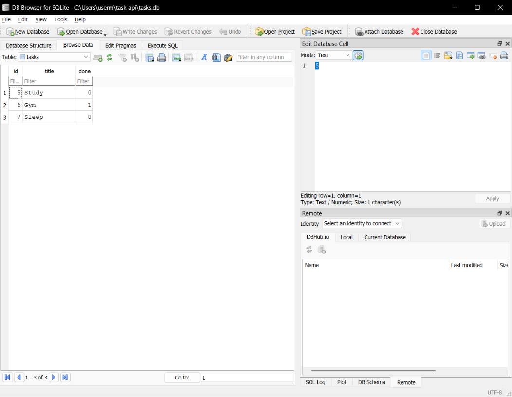

# Task API

A simple CRUD API built with FastAPI and SQLite for managing tasks.

## Features

* Create a task
* Read all tasks
* Read a task by ID
* Update a task
* Delete a task
* Data is stored in SQLite
* Data persists after server restart
* Swagger UI documentation

## Why SQLite?

SQLite was chosen because it is lightweight, requires no separate database server, stores all data in a single file, and is easy to integrate with FastAPI. It is ideal for small backend projects and learning database fundamentals.

## Database

The application stores all tasks in a SQLite database file:

```text
tasks.db
```

The database and the `tasks` table are created automatically the first time the application runs.

## Requirements

* Python 3.9+
* FastAPI
* Uvicorn
* SQLite (built into Python)

## Installation

1. Clone the repository:

```bash
git clone https://github.com/Mohamed18122/task-api.git
cd task-api
```

2. Create a virtual environment:

```bash
python -m venv venv
```

3. Activate the virtual environment.

Windows:

```bash
.\venv\Scripts\Activate.ps1
```

4. Install dependencies:

```bash
pip install fastapi uvicorn
```

## Run

```bash
uvicorn main:app --reload
```

The API will be available at:

```
http://127.0.0.1:8000
```

Swagger UI:

```
http://127.0.0.1:8000/docs
```

## API Endpoints

| Method | Endpoint         | Description       |
| ------ | ---------------- | ----------------- |
| GET    | /                | API information   |
| GET    | /health          | Health check      |
| GET    | /tasks           | Get all tasks     |
| GET    | /tasks/{task_id} | Get a task by ID  |
| POST   | /tasks           | Create a new task |
| PUT    | /tasks/{task_id} | Update a task     |
| DELETE | /tasks/{task_id} | Delete a task     |

## Example SQL Query

```sql
SELECT * FROM tasks;
```

## Database Screenshot

Add a screenshot of the **DB Browser for SQLite** window here after opening `tasks.db`.

Example:

```
database-screenshot.png
```

Then reference it like this:

```markdown

```

## Swagger UI


## Protected Profile


## Repository

This project is published on GitHub as part of the assignment submission.

## Notes

* Tasks are stored in SQLite instead of memory.
* Data persists after restarting the server.
* The database file (`tasks.db`) is created automatically if it does not exist.
* The `tasks` table is also created automatically.
* Three sample tasks are inserted only the first time the application runs.

