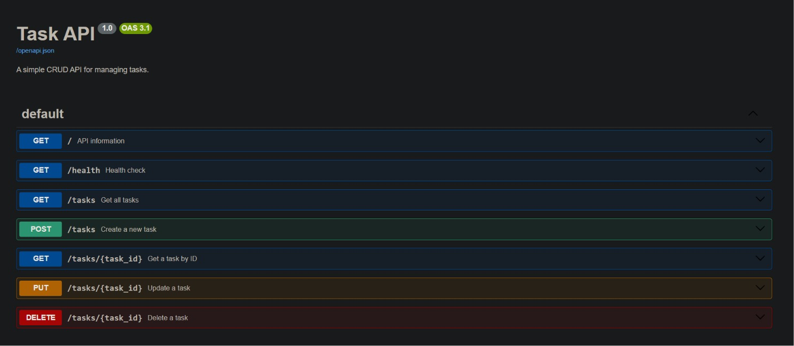

# Task API

A simple CRUD API built with FastAPI for managing tasks in memory.

## Features

- Create a task
- Read all tasks
- Read a task by ID
- Update a task
- Delete a task
- Health check endpoint
- Swagger UI documentation

## Requirements

- Python 3.9+
- FastAPI
- Uvicorn

## Installation

1. Clone the repository:

```bash
git clone https://github.com/Mohamed18122/task-api.git
cd task-api
```

2. Create a virtual environment:

```bash
python -m venv venv
```

3. Activate the virtual environment.

Windows:

```bash
.\venv\Scripts\Activate.ps1
```

4. Install dependencies:

```bash
pip install fastapi uvicorn
```

## Run

```bash
uvicorn main:app --reload
```

The API will be available at:

http://127.0.0.1:8000

Swagger UI:

http://127.0.0.1:8000/docs

## API Endpoints

| Method | Endpoint | Description |
|--------|----------|-------------|
| GET | / | API information |
| GET | /health | Health check |
| GET | /tasks | Get all tasks |
| GET | /tasks/{task_id} | Get a task by ID |
| POST | /tasks | Create a new task |
| PUT | /tasks/{task_id} | Update a task |
| DELETE | /tasks/{task_id} | Delete a task |

## Example curl

```bash
curl -i http://127.0.0.1:8000/tasks
```

Example response:

```http
HTTP/1.1 200 OK
```

```json
[
  {
    "id": 1,
    "title": "Study",
    "done": false
  }
]
```

## Swagger UI

Add your Swagger screenshot here after uploading it to the repository.

Example:

```

```

## Notes

- Tasks are stored in memory.
- Restarting the server resets all tasks.
- No database is used in this project.